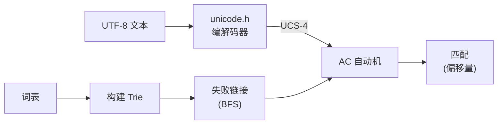
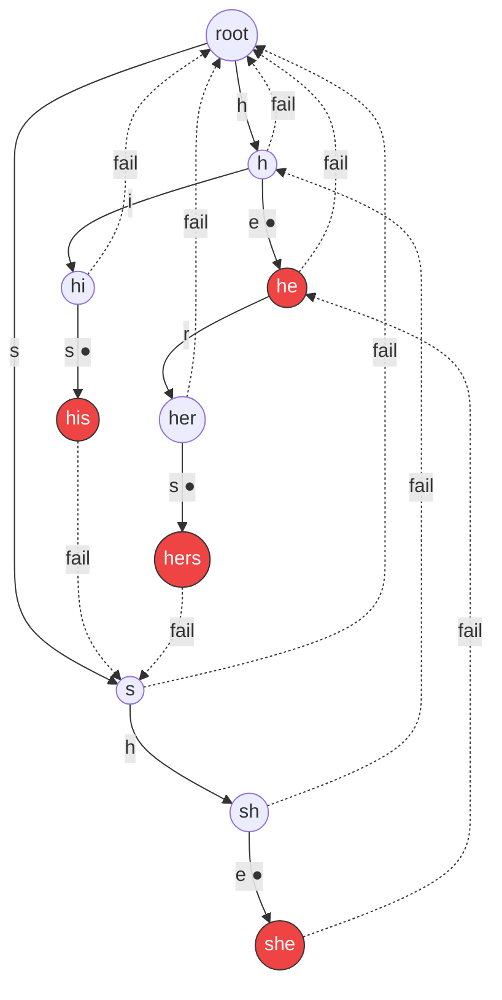
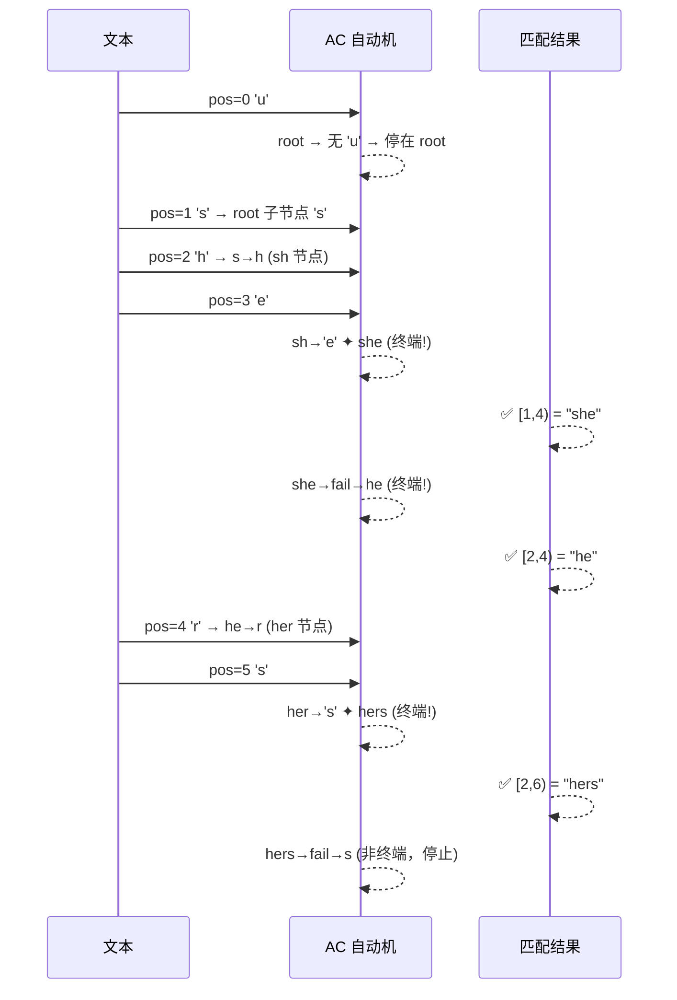

# ccac

基于 Aho-Corasick 自动机的多模式关键词匹配库，纯 C 头文件实现。

**语言:** 中文 | [English](README.md)

[](LICENSE)
[](ccac.h)

## 特性

- **O(n) 搜索时间** — 与字典大小无关，仅取决于文本长度
- **原生 UTF-8 支持** — 内置 UCS-4 编解码器，正确处理中文、emoji 等多字节字符
- **双后端容器** — 哈希表 (`ccac.h`) 或红黑树 (`ccac1.h`)，ABI 兼容可按需替换
- **两种搜索模式** — 记录模式（收集所有匹配）和检测模式（仅判断是否存在）
- **增量构建** — 支持 `ccac_build` 批量构建和 `ccac_add` 动态追加词汇
- **自定义分隔符** — 词表支持任意分隔符（换行、逗号、竖线等）
- **零外部依赖** — 仅依赖 C 标准库，容器通过 git submodule 引入
- **跨平台** — C99+ / C11 / C++ / MSVC，`-Wall -Wextra` 零警告

## 快速开始

```bash
git clone --recurse-submodules https://github.com/CandyMi/ccac.git
```

```c
#include "ccac.h"

int main() {
    ccac_t ac;
    ccac_init(&ac);

    // 批量构建词表
    const char *dict = "hello\nworld\n测试\n敏感词\n";
    ccac_build(&ac, dict, strlen(dict), '\n');

    // 搜索文本
    const char *text = "这是一个包含敏感词的测试文本";
    ccac_match_t matches[16];
    int n = 16;
    ccac_match(&ac, text, strlen(text), matches, &n);

    for (int i = 0; i < n; i++) {
        printf("匹配 [%zu, %zu): %.*s\n",
               matches[i].s, matches[i].e,
               (int)(matches[i].e - matches[i].s),
               text + matches[i].s);
    }

    ccac_destroy(&ac);
    return 0;
}
```

## 构建与测试

### CMake（推荐）

```bash
# 配置 + 构建
cmake -S . -B build -DCMAKE_BUILD_TYPE=Release
cmake --build build -j4

# 运行全部测试
ctest --test-dir build --output-on-failure

# 一键构建 + 测试
cmake --build build --target check -j4
ctest --test-dir build --output-on-failure

# Benchmark（需要 PCRE2）
cmake --build build --target bench

# 安装头文件
cmake --install build --prefix /usr/local
```

所有中间文件严格在 `build/` 内生成。

### 手动编译

```bash
INC="-I. -I3rd/ccalg/include"

# 编解码器测试
cc -std=c99 -Wall -Wextra -I. -o test_unicode tests/test_unicode.c && ./test_unicode

# 单元测试
cc -std=c99 -Wall -Wextra $INC -o test_ccac tests/test_ccac.c && ./test_ccac

# 鲁棒性测试
cc -std=c99 -Wall -Wextra $INC -o test_ccac_robust tests/test_ccac_robust.c && ./test_ccac_robust

# 压力测试（需要生成数据）
python3 scripts/gen_words.py
python3 scripts/gen_stress_text.py words.zh.txt stress_text.txt 3
cc -std=c99 -O2 -Wall -Wextra $INC -o test_ccac_stress tests/test_ccac_stress.c
./test_ccac_stress words.zh.txt stress_text.txt stress_text.txt.pos
```

## API

| 函数 | 说明 |
|------|------|
| `ccac_init(ac)` | 初始化自动机 |
| `ccac_destroy(ac)` | 释放所有资源 |
| `ccac_build(ac, words, len, delim)` | 从分隔符词表批量构建 |
| `ccac_add(ac, word, len, &dup)` | 动态追加单个词 |
| `ccac_match(ac, text, len, matches, &nmatch)` | 搜索文本 |

`ccac_match` 两种模式：

| `matches` | 行为 |
|-----------|------|
| `!= NULL` | 记录模式 — 写入最多 `*nmatch` 条结果到缓冲区 |
| `== NULL` | 检测模式 — 命中即返回，`*nmatch` = 1 找到 / 0 未找到 |

### 匹配结果

```c
typedef struct ccac_match {
    size_t s;  // 原文中的起始字节偏移
    size_t e;  // 结束字节偏移 (e - s = 字节长度)
} ccac_match_t;
```

## ccac vs ccac1

| | `ccac.h` | `ccac1.h` |
|---|---|---|
| 子节点容器 | `cchashmap`（哈希表） | `ccmap`（红黑树） |
| 查找复杂度 | O(1) 平均 | O(log n) |
| 内存分配 | 桶数组（自动扩容） | 零内部分配 |
| 适用场景 | 字符集大、追求速度 | 内存受限、节点数少 |

两者类型和函数签名完全一致，更换 `#include` 即可切换。

## 文件结构

```
ccac/
├── ccac.h           # 哈希表变体
├── ccac1.h          # 红黑树变体（ABI 兼容）
├── unicode.h        # UTF-8 ↔ UCS-4 编解码器（零依赖）
├── 3rd/ccalg/       # [git submodule] 第三方容器库
├── CMakeLists.txt   # 构建系统
├── AGENTS.md        # AI Agent 规范参考
├── tests/           # 测试套件
│   ├── test_ccac.c
│   ├── test_ccac_robust.c
│   ├── test_ccac_stress.c
│   └── test_unicode.c
├── bench/           # 性能对比
│   └── bench_ccac.c
└── scripts/         # 数据生成
    ├── gen_words.py
    └── gen_stress_text.py
```

## 性能

50,000 中文词 / 3 MB 文本（Apple M1）：

| 指标 | 数值 |
|------|------|
| 构建速度 | 469,867 词/秒 |
| 搜索吞吐量 | 63.2 MB/s |
| 召回率 | 100% |
| vs naive (strstr) 投影 | **2,357×** 更快 |
| vs PCRE2（封顶） | **1.6×** 更快 |

## 工作原理

### 架构



### Trie 与失败链接

以字典 `{he, she, his, hers}` 为例：



**●** = 终端节点（字典词的结束）。虚线 = 失败链接。

### 搜索示例

在文本 `"ushers"` 中搜索上述字典：



### Trie 结构

每个节点存储一个 UCS-4 码点。终端节点记录字典词的原始 UTF-8 字节长度，用于 O(1) 计算匹配起始偏移。子节点查找通过哈希表或红黑树实现。

### 失败链接

从根节点一次 BFS 构建：对每个节点 `v` 及其在码点 `x` 上的子节点 `c`，沿 `v->fail` 上溯直到找到含 `x` 子节点的节点（或根），然后设置 `c->fail`。总耗时 O(节点数)。

### unicode.h 编解码器

自包含的 UTF-8 ↔ UCS-4 实现：

| 函数 | 方向 |
|------|------|
| `ccac_unicode_to_codepoint(str, len, &val)` | UTF-8 → UCS-4 |
| `ccac_codepoint_to_unicode(val, str, &len)` | UCS-4 → UTF-8 |

性能设计：ASCII 快速路径、256 字节首字分类查表、fall-through switch 展开续字节处理。遵循 Unicode 17.0 / RFC 3629 规范。

## 许可证

BSD 3-Clause © CandyMi
