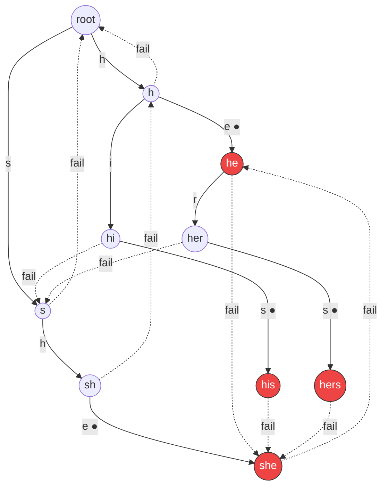
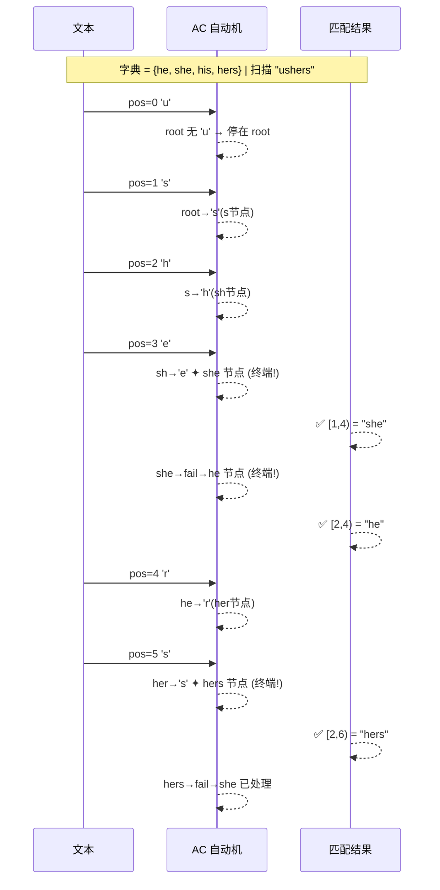
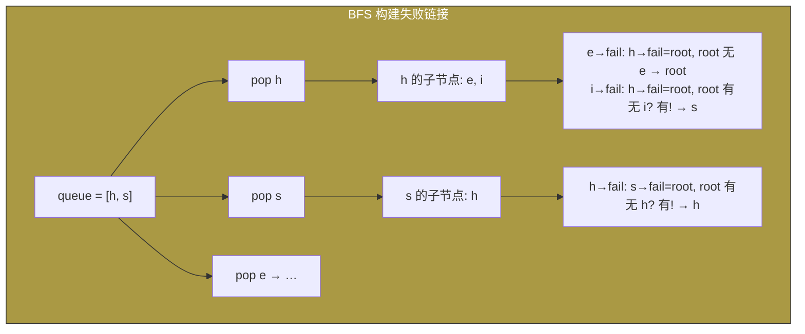
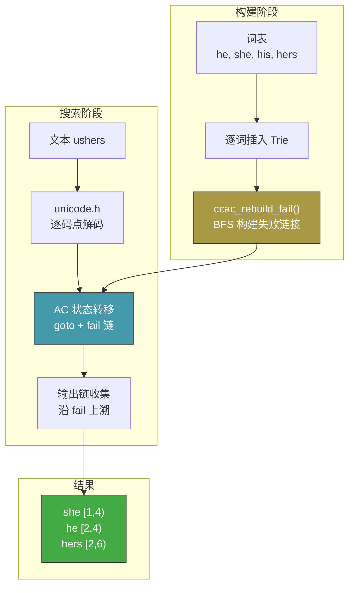

# AC 自动机工作原理

## 1. 系统架构

[▶ 在线编辑](https://mermaid.live/edit#pako:eNp1kcFOg0AQhl9lsqdqorRaCzYe9GLiQRNN6M3EG7ssJQm7y-6gapq-el-IZW2tJ5L5Z-bLN_-MIHIEQgk5wVFX5T7Tk2UQe_4nOtxEDq3i8zUjDmdZbVZamCI3b2sdqUZw5wyVcQ6DMkC7KHSqT2KufVR8x7k4uLd0A59dS1tWw7J3d4zFgo6cEW9RBztP6RudSOsnspWX6s2hVl-YGrctd4clRg0RkYkDFmqQDFjLEnSsTwjHWqAyqKRQRMgYjxGSsYLyHnsbFROjeLZ9h7MokM9Z1S2ytDmi3LxvuFXt6_DCYfbu5TX78B4-UqQvXORbt2LuYp_0nX0__cnb3j3mmY9VzYUb6ueIn_uz5YyCCxFWxhxh3y8Nu0pH_OD3jn1mORrVBn9GAR3X_4lXcCPnL_cY0P47c5HcO4mnPgJp9ehe0YvD3KdK3dvXf9tKMKz_AfdBuCM)

## 2. Trie 构建 + 失败链接

以字典 `{he, she, his, hers}` 为例。

[▶ 在线编辑](https://mermaid.live/edit#pako:eNp1Uk1rAjEQ_SthTlUR1123q4WC0J4KhYKXUsnDqNk1bjbRZFfF-t-73Q_3tLCHvMy85H3MY45QkAJCFfAH8ip0Kj3PUk_FJhGlSfnOcH_M3gT2WWpXNi4rhREoZMdK7NOh-7FG2H50C0h1Bc8QGYMlOFZJbhJniCd3OAusqL-QJwOZR2-ffEcl2gm4jj4Q2DEb16ihMii7Eb_4LMqKjD7LVi8aD1LJsjEZkmXGQEkio0YJZSoNNEaUn9CgzlElP0vRJkMz3nKUom08ZSB1a_qRSKpSojSVZAFndAXRVmng9yxg3W_lsSvuL-wgj_64ahVLFBT_zPv66F4KVhzXf1Wc6VltWhDcn2NL7uTRdVHQY7lsRV44Vz1Nnmjl5mSfCw3Fw2M8vU-4_slQKOxde7ZDoWFNc4fDZg_SxkbX_ze6_Tu9cIkb9rnEt-WIXYx5XTk__Vg-aIZ3rNm3Hv8A5kU4Nw)

## 3. 搜索过程 — 文本 `"ushers"` 匹配

[▶ 在线编辑](https://mermaid.live/edit#pako:eNp1U01vgkAQ_SvkTBVBBT_QJh7ai6lJEz2aemDIqFvLLrNLbU38712w0hQP5LD78ebt4-WFK1kxpHgTYcqHLPJMw7SISvFRop4lCzpH_cJ0gHEk9U6GQcezga2EMyw3aJBJ9sOxEguOwc66IEZDyF7Ane4NAoHmhI7FZRLVEAfSII0HCGKH9gDvPWIwbDBAGK67IF4UzBBNGdFlYckrVXKEHCGv-LI2Gkna9x-uk4a4DgqVcbrZvUJBXvozcpwylOnoZ4Fn4i9JSr7jv7il6y06pUO8ZkcdFg7vu10D6M43cK_NlNphvszSL3NNPzU0JtTAMgX1B-ry5_37gPb_42kJ0zts1_2S_KkOEnYMq7ruo1hEdah_aLUqzUm1YJds9nX1SrlpFrXehfVXpW1cVY_J8AEqJkVWCX0Amj_nPqrx_AFYS_9o)

## 4. 失败链接构建 — BFS 流程

[▶ 在线编辑](https://mermaid.live/edit#pako:eNp1kU1PhDAQhv8KmbNkWVkQ8IibPejFZA8m6sF4IdayXdgJpYQWdzX-d6eUr4MHzn3e5-PNFERwhQQ1fOMkJ1VxFW3qnCjQ5WkoVwyyhNkDPgdp3WRhNE5hWgMawg-MgI1JLr2FEbC9HgSS3CUk0G4DmNJpNEkoUTRa1TCiHQ3uClQkKB3oNCrZDZIG4oH-mCCjBE8s0B84rsJggfDJpPbNXUxGe6sm7rft7pOyyIbfwYjEN0myi7-TTv_O6jGWJbjXK-x6_I8-MHiOUL17tefNIB1sfm6qJkzFfPvJnrSbTVawRbtdWV23nTNiOJtN4ZkRYtINLQ_Gv7Ee7r0nTPTG40WDPsIG3dxXby4a2AA)

## 5. 完整工作流 — 从词表到匹配

[▶ 在线编辑](https://mermaid.live/edit#pako:eNp1Uk1rg0AQ_SuypxZEYjRqikIPbaGlH0ChBHMRPGHUGl13dccWk_73rn7QGPFgLytv3rzHzOyAM0GRYMPfOMkpK7jRWzrnPGVxi6_GBP2YqSlC6El7FWIvFdSKFyISnCfv4MRnRkKpcQTGkmm2Ag8Ni4YM8QFxPPPFROAtefIMBP5cTlDMGzLrA4mwhxIj-JJq3pPZDkc_kxNHTcFrq5T3N0lKSmTYr8kQhSZF7z7-YZz6OIpKfB_mnu0sezBmBmbHvp_hEC3emOq5brP_wSmy4VfkGcM_O95HfaMj07vrfjKqzIim4gWlGBdH_k4j96gjG7RxmDa-4imCNfbs7aAb7jY5T0PTfNwNXvs3Lnmb83r0vlRBp1nOd83r8_Tk5t4Q6-YHwYi3DzhPkC3W_5bGP1gXt_YVk3ba-nK2rmBUHeXssrwfOszHqFGVGv1N4NFiNl_b55mAgUFDgd-oEKPc_mtmH1cCnsBQxso9j7ukCNtpPLPpbrtoCHPRymX-jT0yS4MWZod89hrbaBbCwYL13aWi8AcAycM1)

---

### 在浏览器中查看

将上面的 **Mermaid 代码** 粘贴到 [mermaid.live](https://mermaid.live) 即可在线渲染。

或直接点击每个图下方的 **[▶ 在线编辑]** 链接。
