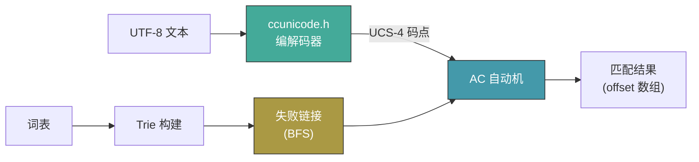
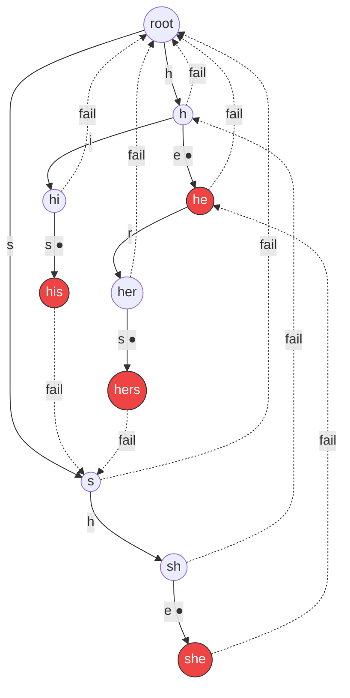
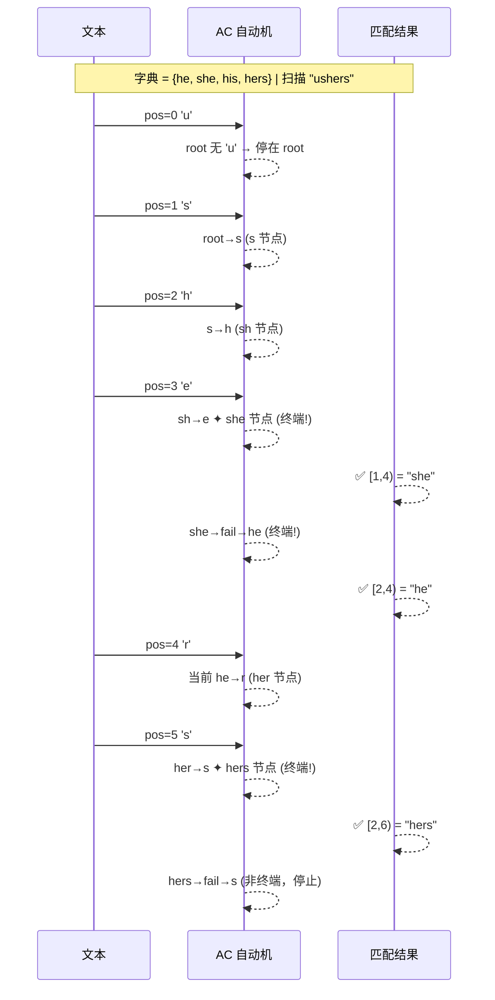
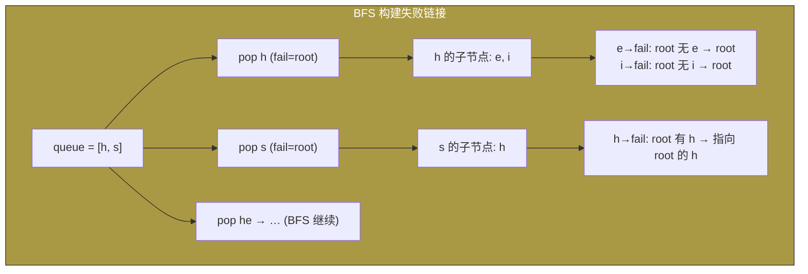
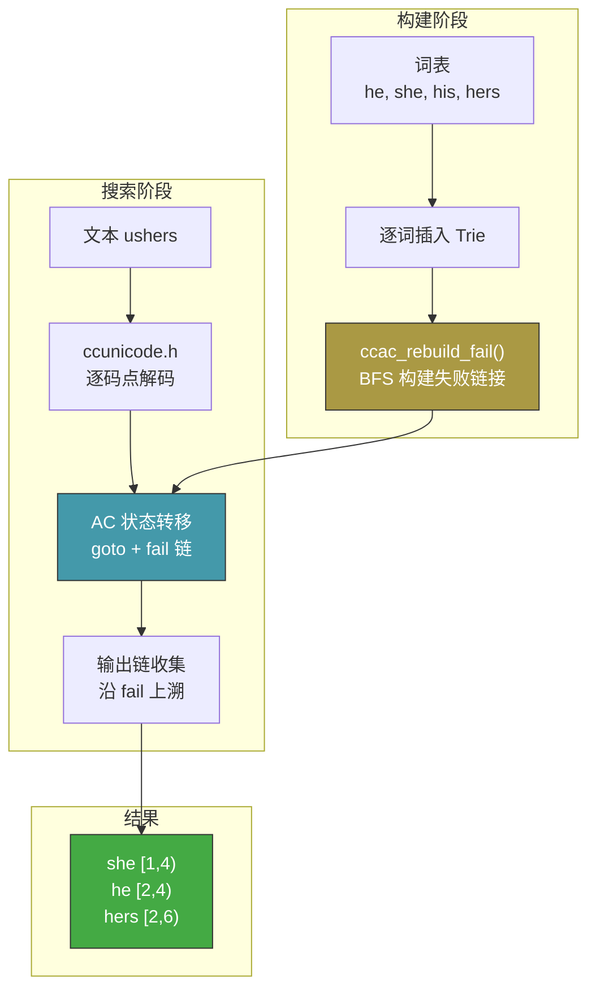

# AC 自动机工作原理

## 1. 系统架构

[▶ 在线编辑](https://mermaid.live/edit#pako:eNp1kcFOg0AQhl9lsqdqorRaCzYe9GLiQRNN6M3EG7ssJQm7y-6gapq-el-IZW2tJ5L5Z-bLN_-MIHIEQgk5wVFX5T7Tk2UQe_4nOtxEDq3i8zUjDmdZbVZamCI3b2sdqUZw5wyVcQ6DMkC7KHSqT2KufVR8x7k4uLd0A59dS1tWw7J3d4zFgo6cEW9RBztP6RudSOsnspWX6s2hVl-YGrctd4clRg0RkYkDFmqQDFjLEnSsTwjHWqAyqKRQRMgYjxGSsYLyHnsbFROjeLZ9h7MokM9Z1S2ytDmi3LxvuFXt6_DCYfbu5TX78B4-UqQvXORbt2LuYp_0nX0__cnb3j3mmY9VzYUb6ueIn_uz5YyCCxFWxhxh3y8Nu0pH_OD3jn1mORrVBn9GAR3X_4lXcCPnL_cY0P47c5HcO4mnPgJp9ehe0YvD3KdK3dvXf9tKMKz_AfdBuCM)

## 2. Trie 构建 + 失败链接

以字典 `{he, she, his, hers}` 为例。

BFS 构建失败链接规则：对节点 `v` 的子节点 `c`（码点 `x`），沿 `v→fail` 上溯直到找到含有 `x` 子节点的节点（或 root），`c→fail` 指向该子节点。

[▶ 在线编辑](https://mermaid.live/edit#pako:eNqNUstrwjAU_ithrhVUtK22RWHgduPChQs3Qk9H0LbNmoesL6z47zvpQ2sXgRzad849L0KO0JIESiriD7JxSF1W3gNTRCbXG-vZGJW8GeylCqHdNtLGpQRNY5XQMiYR5dWdjVG55jLAkMXBPLIJkBo3Q2KH6xACxpM-cPzHyDHEjAgIRtgDmpMIJkS3xAKjEDGBFU0Y9hNGoCHqyzyHltBqBB8rT9CNVtIjI0d1gymqsGtyL-LVt3ZKLxhV-23aQuMspMSDz_LHquZXQ3VYnpHnC40lnGCNLlBMdWkWNk8sL2dhtbfkrvMFQn2fH3PlsTlbjLNHAq9Rnt14Ls4sL-k-FPb5lNuT_yBuN2wOo3cU3V_ba3rxMFQ7a_L-6v1QLH18IF3C4bl6Y8D3L_MkUB4bZjWDRQ7qTNU82StPSWvovLwAr4G2XA)

## 3. 搜索过程 — 文本 `"ushers"` 匹配

[▶ 在线编辑](https://mermaid.live/edit#pako:eNp1U01vgkAQ_StkjmpQUA5KYxraS01NmuiRmh6IS0fYuhssW1qN8b93gYVSHE4wM2_em3kvPEEhGBIs4BdOSsqZMLE54UxSHjbyGhowxbqK9aaw4o1q8JRNTAyht0ZHT7ZFuVPaIKRjQLEgVEM6u3JK_MeIFdGaeHIFUSItjwK5csTZgyv9W74i1jAHUOKbmNze4dxmKmUe1Gz5wPL8nNRcnEOSCg4BTuH6m9jyOyy9cvI5SHB4n2oWjsxH3OoSTUsXH1-vCd13f1DPlzH-o2B7Gx40tHn4wmIdniP_YtbG6gyLvMELJ3TVnt0_RmGktoz1x7P18CSmBZHnYl0YqfvEl2fyh27kP4xPln0shFJ8fR93zEeG5XdFhY3DGRYL06HmH6bH8XszwvRvBz_IC3tx3UjiFPIavkYqL4f7J1n9JjxnH1FyH2ufkfKX4J47NM2o-ntZ0O02TTX5BtfhVnyws5Gua84UWHi--ULZz74kzh1W)

## 4. 失败链接构建 — BFS 流程

[▶ 在线编辑](https://mermaid.live/edit#pako:eNp1kU1PhDAQhv8KmbNkkeVFQCAk7kEve3CPJhqP1EU7pSvQQoWfu9N1QVnW43Te5-m8kyEUxBAkhPAVR2lW5GfRpEyJAl2ahmKfQpYwu8H7IK7qNAxGMUwqQEN4jhGwMclktzAEttMDh7KR4BGahScmcjwex1QUj5qGx2gHvY0C5QiFBR04Jbs6qSEaqAcJlBh8q8OnlzLBc4R3KrU3dTLsLZW5eY_s45BFNvwMRiS-SZKH-BO0_ndWD5EsIPe-x5zId_YHhu8RqleR56lRBNJ3S5PVIStIf_1Nn4hFU7awbLfKVd1ypGjI9lMopojIuEFfq-Hf2B_ckXNBtN143muwNKzJSb7Ya9GAFA)

## 5. 完整工作流 — 从词表到匹配

[▶ 在线编辑](https://mermaid.live/edit#pako:eNp1Uk1rg0AQ_SuyJw8EYtREKXpoCyn5CJRQiMc6alTd4O4ou2Gt_707-hHrowf9mDdv3mNmdpgnihQIfPFHCqWMG7WlM14KEbn1rY3gW6JuAvuh7K-lExYKI8RkIRXTQSqhPGiGUO3tJmSgCT4jRxrE0IAxJcI4EuSx-EGhMQgOIgLHZ0cMQCQ0IIMm9oEDg5FnJRBoUiQDyLHm55Rh2Ak2OjwT8wmlOxFTIAYjMZjW2Mf3bJUfFEKVF5ucEPPKWf-98P08fY6uE7T5fzbm8vHqPHnBqR1uyVuXbjrv9OebDzdA9v1k0beNr3OF0_qXlVp_o_3Idw_Lp8XbaQ7ZeB8aKcyn7fu5VXlrLf95Xr2MDoNvK16mYmXpvJz2iFbMdfaoL-bfIRr44sGy5b09j_4FPXlyXJ-R3X5QqXWQ9md06DM76Wn1u62pugr5IMoGJ2YjWl7jQD-C8XZ22RmBt3Gxdm3HFyDZ1y3Yr-xNkm3fSNPNHnWTaYMylV0fQ-2PdBdo02KSvYjXTR4k3V_YgLCz)

---

在 [mermaid.live](https://mermaid.live) 粘贴代码即可在线渲染。或点击每个图下方的 **▶ 在线编辑** 链接。
